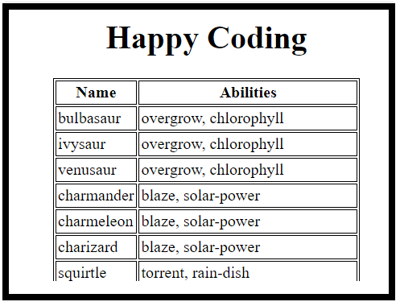
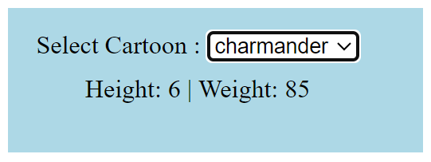
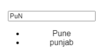

### Question 1  - Publicis Sepient  
- Write html, css, js to fetch Api then list them into 1st td  
- And fetch each cartoon api, list them in second td  
- Api - [https://pokeapi.co/api/v2/pokemon/](https://pokeapi.co/api/v2/pokemon/)  
- > Output 


```html
<html>
    <head>
        <title>My Page</title>
        <meta name="viewport" content="width=device-width, initial-scale=1.0" />
        <link rel="stylesheet" href="./index.css"/>
    </head>
    <body>
        <h1>Happy Coding</h1>
        <table>
            <thead>
                <tr>
                    <th>Name</th>
                    <th>Abilities</th>
                </tr>
            </thead>
            <tbody id ="tbody">
            </tbody>
        </table>
        <script src="./index.js" > </script>
    </body>
</html>
```

```css
body{
    display: flex;
    align-items: center;
    justify-content: center;
    flex-direction: column;
}
div {
    margin-top: 10px;
}
table, tr, th, td {
    border:1px solid black;
}
th, td {
    padding : 2px
}
```

```javascript
// Javascript code
const tbody = document.querySelector('#tbody');
const sourceUrl = 'https://pokeapi.co/api/v2/pokemon/';
const loadData = (url) =>{
    fetch(url).then(data => data.json())
    .then(res => loadTable(res.results))
}

loadData(sourceUrl);
const loadTable = (allData) =>{
    const allPromise = allData.map(({name, url}) =>{
        return fetch(url).then(data => data.json());
    })
    Promise.all(allPromise).then((res) =>{
        res.map((item, index) => {
            const {abilities} = item;
            const arrAbilities = abilities
            .map((item,i)=>{
                return item.ability.name;
            })
            const tr = document.createElement('tr');
            const td1 = document.createElement('td');
            const td2 = document.createElement('td');
            td1.textContent = allData[index].name;
            td2.textContent = arrAbilities.join(', ')
            tr.appendChild(td1);
            tr.appendChild(td2);
            tbody.appendChild(tr)
        })
    })
}
```
---

### Question 2  - Publicis Sepient  
- Write html, css, js to fetch Api then list them into select-option box
- on selection change show height , weight, moves 
- Api - [https://pokeapi.co/api/v2/pokemon/](https://pokeapi.co/api/v2/pokemon/)  
- >Output 

```html
<html>
    <head>
        <title>mypage</title>
        <meta name="viewport" content="width=device-width, initial-scale=1" />
        <link rel="stylesheet" href="./style.css" />
    </head>
    <body>
        <div class="container">
            <div>
                Select Cartoon : 
                <select onchange="loadSelectedOption(this.value)" id="sel"></select>
            </div>
            <div id="output"></div>
        </div>
    </body>
</html>
<script src="./index.js"></script>
```

```css
body{
    background-color: lightgreen;
}
.container {
    display: flex;
    flex-direction: column;
    align-items: center;
}
.container div {
    margin-top: 8px;
}
@media screen and (min-width:0px) and (max-width: 400px) {
    body{
        background-color: lightcoral;
    }
}

@media screen and (min-width:400px) and (max-width:800px) {
    body{
        background-color: lightblue;
    }
}
@media print {
    h1{
        display: none;
    }
}
```

```javascript
// javascript
var allData = [];
var cache = {};
const loadData = () =>{
    fetch('https://pokeapi.co/api/v2/pokemon/')
    .then(data => data.json())
    .then( res => {loadOptions(res)})
    .catch(err =>{
        throw new Error(err)
    })
}
loadData();
function loadOptions(data) {
    const sel = document.querySelector('#sel');
    
    allData = data.results;
    allData.map(({name, url},index)=>{
        const strId = `${name}_${url}`
        const op = document.createElement('option');
        op.className= 'api_option';
        op.id = strId;
        op.value = strId;
        op.textContent = name
        sel.appendChild(op)
        if(index == 0) {
            loadSelectedOption(strId)
        }
    })
    
}
function loadSelectedOption(val) {
    let [name, url] = val.split('_');
    if(cache[name]) {
        loadOutput(cache[name])
        console.log('from cache', cache)
    } else {
        fetch(url).then(data => data.json())
        .then(res => { 
            loadOutput(res)
            cache[name] = res;
        } )
        
    }
}

let loadOutput = (res) =>{
    const {weight, name,height, id, is_default} = res;
    const str = `Height: ${height} | Weight: ${weight}`
    const out = document.querySelector('#output');
    out.innerText = str;
}
```

---
### Question 3 - React - Coforge
- Search text from city array, should be case Sensitive
> Output 
```javascript
import "./styles.css";
import react, { useState } from "react";

export default function App() {
  const cities = ["Pune", "patna", "punjab", "jaipur", "delhi"];
  let [res, setRes] = useState(cities);
  let [searchText, setSearchText] = useState("");

  const change = (e) => {
    const val = e.target.value?.toLowerCase();
    setSearchText(e.target.value);
    if (val.length) {
      const result =
        cities.filter((item, i) => {
          const newItem = item.toLowerCase();
          return newItem.indexOf(val) === 0;
        }) || [];
      setRes(result);
    } else {
      setRes(cities);
    }
  };

  return (
    <div className="App">
      <h1>Hello CodeSandbox</h1>
      <input type="text" onChange={change} value={searchText} />
      <ul>
        {res.length &&
          res.map((item, index) => {
            return <li key={index}>{item}</li>;
          })}
      </ul>
    </div>
  );
}
```  

---

### Q4 - Memoize with addition - Coforge
```javascript
const memoize = (fn) => {
  let cache = {};
  return (...args) => {
    const strArgs = JSON.stringify(args);
    if(cache[strArgs]) {
      console.log('from cache')
      return cache[strArgs]
    } else {
      const temp = fn(...args);
      cache[strArgs] = temp;
      return cache[strArgs]
    }
  }
}
let add2 = (a,b,c) => a + b + c;
const sum = memoize(add2);
console.log(sum(1,2,3))  // 6
console.log(sum(1,2,3))  // from cache , 6
```
---


